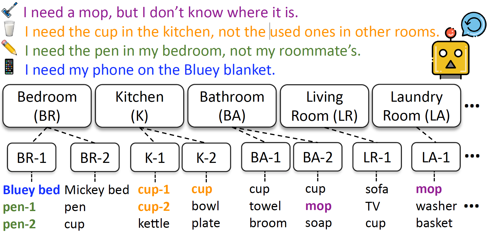
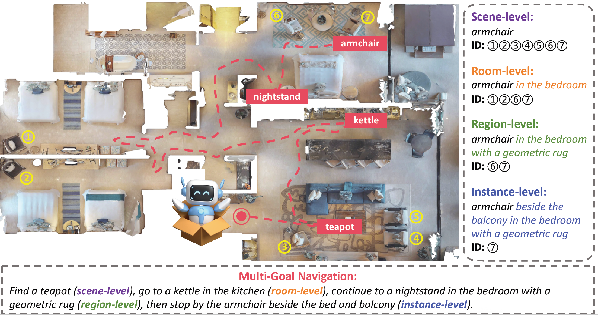

## LangMap: A Hierarchical Benchmark for Open-Vocabulary Goal Navigation

## 🏠 Introduction

HieraNav is an open-vocabulary language-conditioned goal navigation task where agents reach targets across four semantic levels: scene, room, region, and instance.

Language as a Map (LangMap) is the first large-scale benchmark for this task with comprehensive human-verified contrastive annotations.

## ⭐ Highlights

- Built on real-world HM3D indoor scans.

- Human-verified region labels with discriminative descriptions.

- Discriminative instance descriptions covering 414 object categories.

- Both concise and detailed instructions to evaluate different instruction styles.

## ⭐ HieraNav

## ⭐ LangMap

The full benchmark will be released.