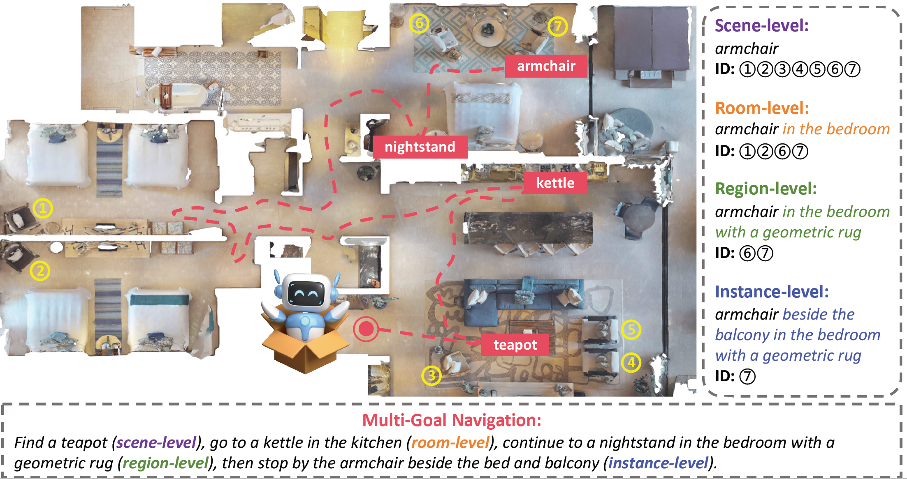
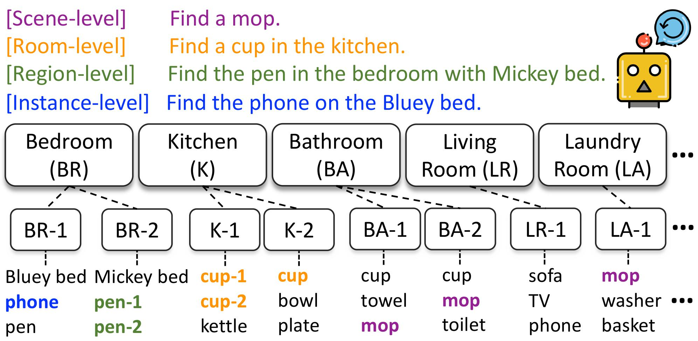

[](https://creativecommons.org/licenses/by/4.0/)
[](https://arxiv.org/html/2602.02220v1)
[](https://bo-miao.github.io/LangMap/)
[](https://huggingface.co/spaces/bo-miao/LangMap)

# LangMap: A Human-Verified Benchmark for Hierarchical Open-Vocabulary Goal Navigation



We introduce HieraNav, a hierarchical open-vocabulary goal navigation task, and LangMap, a large-scale human-verified benchmark providing region labels, discriminative descriptions, and navigation tasks across object, room, region, and instance levels.

We also introduce PlaNaVid, an RGB-only navigation baseline that uses bounded diverse memory without depth, 3D maps, oracle paths, or object masks.

## Highlights

- All HM3D-Sem validation scenes.
- Human-verified semantic annotations:
  - Region labels.
  - Discriminative region descriptions in concise and detailed forms.
  - Discriminative instance descriptions in concise and detailed forms.
- Open-vocabulary goals covering over 400 object categories.
- Single-goal tasks across object, room, region, and instance levels, and mixed-level multi-goal navigation sequences.
- A strong RGB-only baseline that uses bounded diverse memory without depth, 3D maps, oracle paths, or object masks.

## Task Levels



- Object: find any object of the target category, e.g., "Find the armchair."
- Room: find the target object category in a room type, e.g., "Find the armchair in the bedroom."
- Region: find the target object category in a described room instance, e.g., "Find the armchair in the bedroom that has a geometric rug."
- Instance: find a specific object instance from its description, e.g., "Find the black leather armchair."

## Data

LangMap annotations can be downloaded from [Google Drive](https://drive.google.com/drive/folders/1C8CVptKwQVX-8bMzkWQ8MtljrwfvBqkT?usp=drive_link).

Download HM3D and HM3D-Sem from Habitat:

- HM3D: https://aihabitat.org/datasets/hm3d/
- HM3D-Sem: https://aihabitat.org/datasets/hm3d-semantics/

Before evaluation, replace each original HM3D-Sem `*.semantic.txt` file with the matching file from `hm3d_semantic_txt/` in the corresponding HM3D scene folder.
The provided semantic text files use normalized category labels, obtained by mapping the raw object labels with `Mp3d_category_mapping`.

Organize the data as:

```text
data/
├── hm3d/val/
│   ├── 00800-TEEsavR23oF/
│   │   ├── TEEsavR23oF.basis.glb
│   │   ├── TEEsavR23oF.basis.navmesh
│   │   ├── TEEsavR23oF.glb
│   │   ├── TEEsavR23oF.semantic.glb
│   │   └── TEEsavR23oF.semantic.txt
│   └── ...
└── LangMap/annotations/
    └── *.json.gz
```

Each annotation file contains:

```text
goals
region_annotation
episodes_by_object_level
episodes_by_room_level
episodes_by_region_level
episodes_by_instance_level
episode_by_sequence
```

Instruction templates:

```text
Object:   Find the {object_category}.
Room:     Find the {object_category} in the {room_name}.
Region:   Find the {object_category} in the {region_category} that has {region_description}.
Instance: Find the {instance_description}.
```

## Evaluation

Run single-goal evaluation:

```bash
python langmap_single_goal.py \
  --scene_path data/hm3d/val \
  --langmap_path data/LangMap/annotations \
  --result_dir tmp/langmap_single_goal_results \
  --use_concise_description 1
```

Run multi-goal evaluation:

```bash
python langmap_multi_goal.py \
  --scene_path data/hm3d/val \
  --langmap_path data/LangMap/annotations \
  --result_dir tmp/langmap_multi_goal_results \
  --use_concise_description 1
```

Results are saved as:

```text
{scene_name}_{task_type}_{episode_id}.json
```

Analyze single-goal performance:

```bash
python analyze_langmap_results.py \
  --eval-type single \
  --results-dir tmp/langmap_single_goal_results
```

Analyze multi-goal performance:

```bash
python analyze_langmap_results.py \
  --eval-type multi \
  --results-dir tmp/langmap_multi_goal_results
```

Notice: The analysis script reads all existing result files. Check result completeness before running it.


Metrics:

- Single-goal: overall SR/SPL and SR/SPL by object, room, region, and instance levels.
- Multi-goal: overall SR/SPL and SeqSR@k.


## Citation

If you use the LangMap annotations or benchmark, please cite:


```bibtex
@article{miao2026langmap,
  title={LangMap: A Human-Verified Benchmark for Hierarchical Open-Vocabulary Goal Navigation},
  author={Miao, Bo and Liu, Weijia and Luo, Jun and Shinnick, Lachlan and Liu, Jian and Hamilton-Smith, Thomas and Yang, Yuhe and Wu, Zijie and Videnovic, Vanja and Dayoub, Feras and van den Hengel, Anton},
  journal={arXiv preprint arXiv:2602.02220},
  year={2026}
}
```
