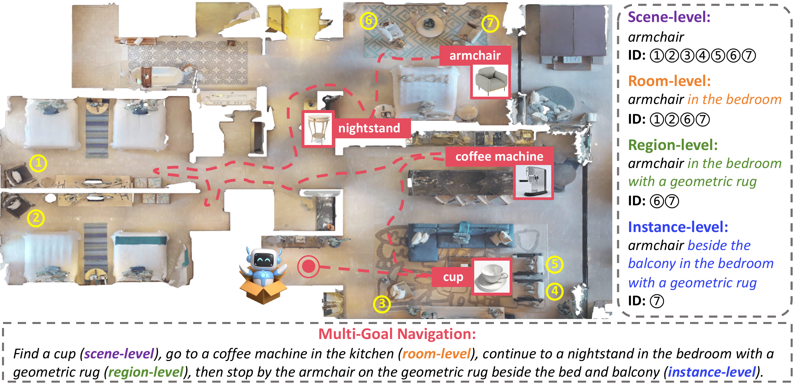

[](https://arxiv.org/abs/2602.02220)
[](https://bo-miao.github.io/LangMap/)
[](https://huggingface.co/datasets/bo-miao/LangMap)
[](LICENSE)


<p align="center">
  
</p>

## LangMap: A Human-Verified Benchmark for Hierarchical Open-Vocabulary Goal Navigation

Bo Miao, Weijia Liu, Jun Luo, Lachlan Shinnick, Jian Liu, Thomas Hamilton-Smith, Yuhe Yang, Zijie Wu, Vanja Videnovic, Feras Dayoub, Anton van den Hengel

This is the official implementation of PlaNaVid and its evaluation on LangMap from our NeurIPS 2026 paper "[LangMap: A Human-Verified Benchmark for Hierarchical Open-Vocabulary Goal Navigation](https://arxiv.org/abs/2602.02220)".

The LangMap annotations and tasks are available on [Hugging Face](https://huggingface.co/datasets/bo-miao/LangMap) (see [Prepare Data](#1-prepare-data)).

## Introduction

* We introduce **HieraNav**, an open-vocabulary language-conditioned goal navigation task with goals at four hierarchical semantic levels: <u>scene, room, region, and instance</u>.
* We present **LangMap** (Language as a Map), a benchmark that enriches real-world indoor 3D scans (HM3D) with extensive human-verified region labels and discriminative region and instance descriptions, supporting single-goal and multi-goal tasks across all four goal levels.
* We propose **PlaNaVid**, an RGB-only baseline that combines Bounded Diverse Memory with high-level planning to prime a reactive policy for multi-goal navigation, without depth, 3D scene representations, or object masks.

## ⭐ LangMap



## 1. Prepare Data

Please organize the data as follows:
```
PlaNaVid/
├── data/
│   ├── LangMap/
│   │   └── annotations/
│   │       └── *.json.gz                # LangMap annotation files
│   └── hm3d/
│       └── val/
│           ├── e.g. 00800-TEEsavR23oF/
│           │   ├── TEEsavR23oF.basis.glb
│           │   └── TEEsavR23oF.semantic.txt
│           └── <other scene folders>/
└── ...
```

### LangMap Annotations

Download the LangMap annotations from [Hugging Face](https://huggingface.co/datasets/bo-miao/LangMap) to `data/LangMap/`:

```
pip install -U "huggingface_hub>=0.34"   # provides the hf command

hf download bo-miao/LangMap \
  --repo-type dataset \
  --include "annotations/*" \
  --local-dir data/LangMap
```

The expected structure is:

```
data/LangMap/
└── annotations/
    ├── 00800-TEEsavR23oF.json.gz
    ├── 00802-wcojb4TFT35.json.gz
    └── ...
```

### HM3D and HM3D-Sem

Please download the HM3D and HM3D-Sem validation scenes from the official Habitat data pages:

- HM3D: https://aihabitat.org/datasets/hm3d/
- HM3D-Sem: https://aihabitat.org/datasets/hm3d-semantics/

We do not redistribute these assets. Place the scene folders under `data/hm3d/val/`.

The expected structure is:

```
data/hm3d/val/
└── <scene_id-scene_name>/
    ├── <scene_name>.basis.glb
    └── <scene_name>.semantic.txt
```

Then convert the HM3D-Sem category names to those used by LangMap (e.g., "trash can" -> "trashcan"); the original files are kept as `*.semantic.txt.orig`:

```bash
python prepare_semantic_txt.py --scene-dir data/hm3d/val
```

## 2. Environment Setup

We run the evaluation on a single NVIDIA RTX 4090 (24 GB). The VLM planner can be accessed via an API or served locally with vLLM.

Please follow [INSTALL.md](INSTALL.md) to set up the environment and download the checkpoints.

## 3. Run Evaluation

PlaNaVid uses a VLM planner for memory-guided waypoint and heading selection. Before running evaluation, either set your API key and URL in the `client_QwenAPI` configuration in `planner.py` or serve the VLM locally using vLLM (e.g., `base_url="http://127.0.0.1:8000/v1"`).

> **Note.** `tmp/` contains our per-task results reported in the paper. New results are written to `tmp/eval_planavid_*`.

Run PlaNaVid on LangMap multi-goal episodes:

```
sh eval_planavid_langmap_multigoal.sh
```

Run PlaNaVid on LangMap single-goal tasks:

```
sh eval_planavid_langmap.sh
```
By default (`CHECK=1`), the scripts evaluate a single scene as a quick check. Set `CHECK=0` (e.g., `CHECK=0 sh eval_planavid_langmap_multigoal.sh`) for the full evaluation (about 20 hours for multi-goal).


### Expected Output

```
[Sequence Episode 5] ======== SUBTASK 1/5 ========
[Sequence Episode 5] Subtask ID: 00820-mL8ThkuaVTM_sequence_17_0
[Sequence Episode 5] Task type: instance
[Sequence Episode 5] Instruction: Find the tv below guitar
[Sequence Episode 5] First subtask: starting from the sequence start position [7.08159, -2.67601, 0.42292]
[Sequence Episode 5] ======== SUBTASK 1 INITIAL STATE ========
[Heading Response:] 2, [Reason:] A clear view shows potential space behind door where TV could logically sit under guitar.
==============================================================

[Sequence Episode 5] ======== SUBTASK 1 FINAL STATE ========
[Sequence Episode 5] Subtask completed after 113 steps
[Sequence Episode 5] Start Position: [ 7.08159 -2.67601  0.42292]
[Sequence Episode 5] Final Position: [1.6908152, -2.5760078, 1.6847589]
[Sequence Episode 5] SR:  1.0 (1=success, 0=failure)
[Sequence Episode 5] SPL: 0.5395
[Sequence Episode 5] =======================================
```


## 4. Analyze Results
A task succeeds if the agent ends within 0.25 m of a goal viewpoint. To compute the metrics from the per-task results, run:

```
python analyze_langmap_results.py \
  --eval-type multi \
  --results-dir tmp/planavid_multi_7b
```

For single-goal evaluation (overall SR and SPL are computed on concise instructions across all four goal levels; detailed instructions are reported separately for comparison):

```
python analyze_langmap_results.py \
  --eval-type single \
  --results-dir tmp/planavid_single_7b
```


## 5. License

The LangMap annotations, task definitions, and documentation are released under [CC BY-NC 4.0](https://creativecommons.org/licenses/by-nc/4.0/). This license does not supersede the terms of HM3D and HM3D-Sem.

## Citation

☀️ If you find this work useful, please kindly cite our paper! ☀️

```
@inproceedings{miao2026langmap,
  title={{LangMap}: A Human-Verified Benchmark for Hierarchical Open-Vocabulary Goal Navigation},
  author={Miao, Bo and Liu, Weijia and Luo, Jun and Shinnick, Lachlan and Liu, Jian and Hamilton-Smith, Thomas and Yang, Yuhe and Wu, Zijie and Videnovic, Vanja and Dayoub, Feras and van den Hengel, Anton},
  booktitle={Advances in Neural Information Processing Systems (NeurIPS)},
  year={2026}
}
```


## Acknowledgements

This project is built on the open-source repositories [Uni-NaVid](https://github.com/jzhzhang/Uni-NaVid), [VLN-CE](https://github.com/jacobkrantz/VLN-CE), and [Habitat](https://github.com/facebookresearch/habitat-lab). Thanks to the authors for their well-organized code!
